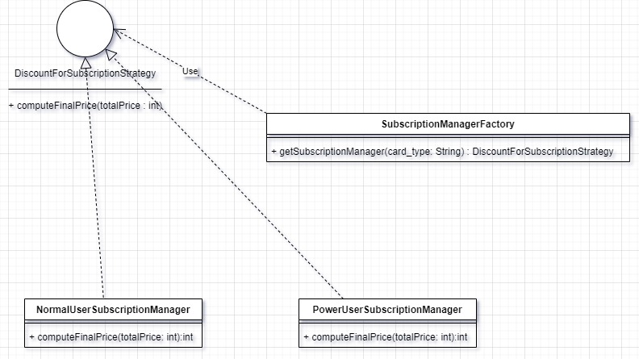
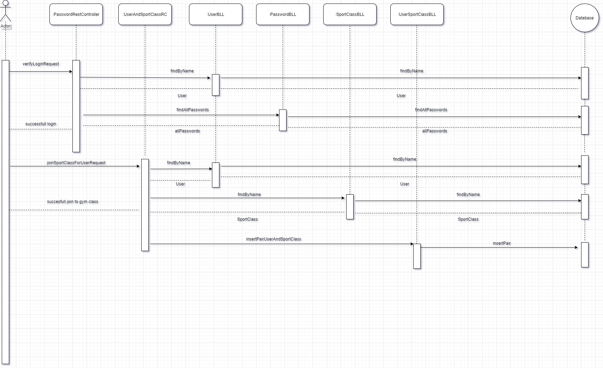
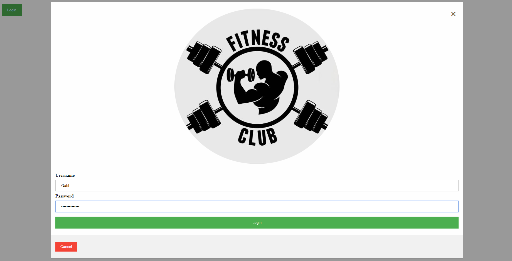
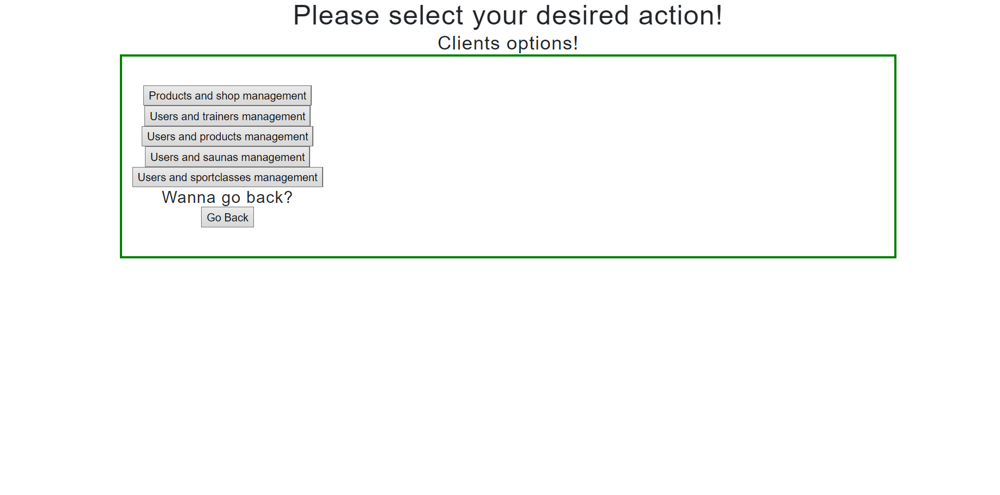
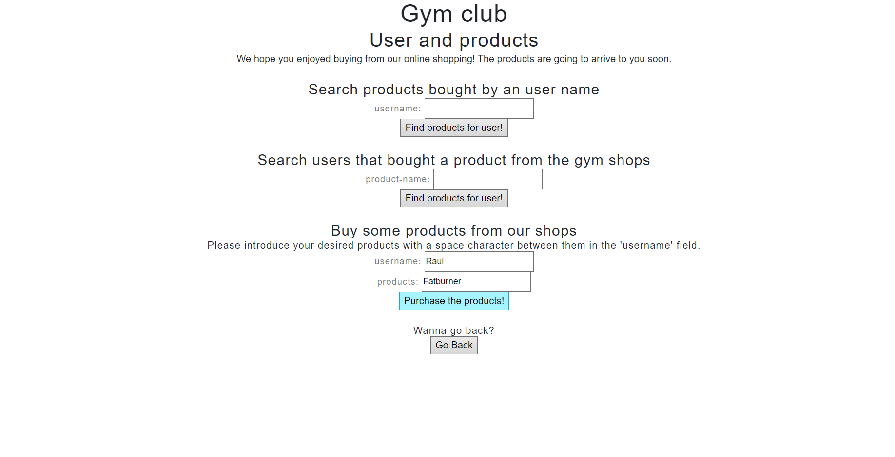
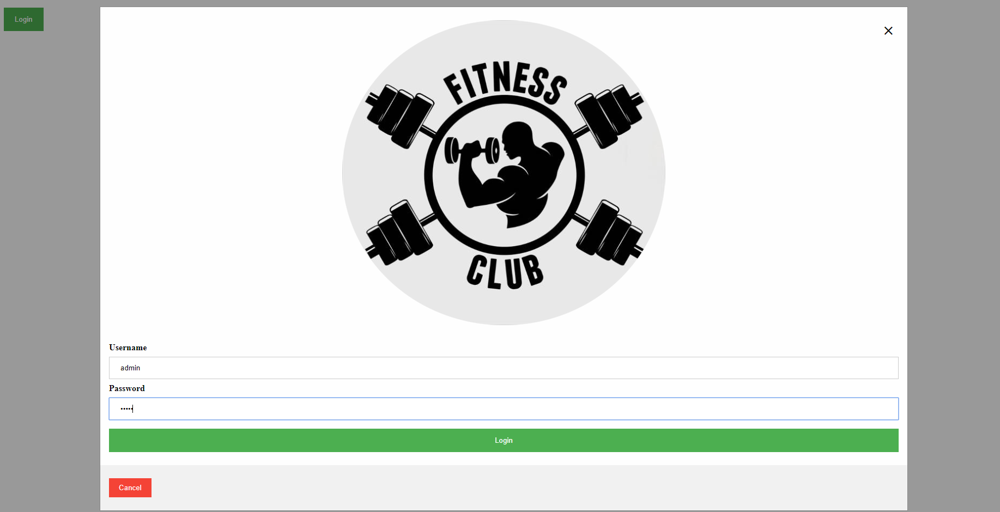
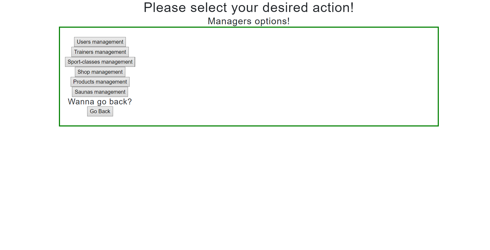
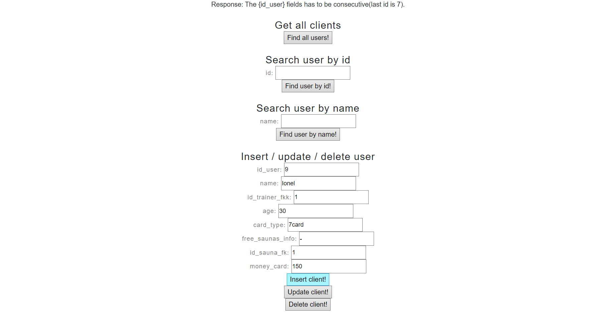

# FitnessProject

# Descrierea problemei
Aplicația Gym Management reprezintă o facilitate prin care orice pasionat de sport poate afla toate detaliile de care are nevoie despre sala de sport pe care acesta o frecventează. Aceasta oferă informații despre:

- Persoanele care au un abonament la sala de sport 
  - nume, antrenorul personal (dacă are unul), vârsta, tipul de abonament
- Antrenorii disponibili pentru a oferi antrenamente personalizate
  - nume, diplomă de absolvire a faculțății de sport / certificat de antrenor personal (dacă are una/unul), prețul pentru o lună de antrenamente personale
- Clasele de sport existente în cadrul sălii (Cycling, Kango-jump, etc)
  - nume, antrenorul personal care ține clasa de sport, prețul unui abonament la clasa de sport pentru o lună de antrenamente
- Management-ul saunelor pentru relaxarea de după antrenament
  - valabilitatea saunei (dacă se poate folosi acum sau nu), durata unei ședințe la saună, numărul maxim de persoane acceptate la saună
- Magazinele deținute de sala de sport
  - numărul magazinului împreună cu tipul de discount oferit al magazinului
- Produsele ce pot fi achiziționate din aceste magazine
  - nume, magazinul în care poate fi găsit, scopul produsului, prețul, cantitatea

Operațiile posibile în momentul de față asupra bazei de date a aplicației sunt:

- adăugarea unui/unei: user / antrenor / clase de sport / saune / magazin / produs (pentru un magazin anume)
- ștergerea unui/unei: user / antrenor / clase de sport / saune / magazin / produs (pentru un magazin anume)
- actualizarea unui/unei: user / antrenor / clase de sport / saune / magazin / produs (pentru un magazin anume)
- găsirea unui/unei: user / antrenor / clase de sport / saune / magazin / produs (pentru un magazin anume)
- găsirea tuturor: user-ilor / antrenorilor / claselor de sport / saunelor / magazinelor / produselor

- login-ul unui user
- achiziționarea de produse din magazinele sălii de sport
- vizualizarea de produse cumpărate în trecut
- plata unui abonament / a mai multor abonamente la clasele sportive ale sălii
- vizualizarea persoanelor participante la o clasă de sport
- înregistrarea intrărilor la saunele sălii
- vizualizarea persoanelor antrenate de către un personal trainer

# API-urile folosite
API (application programming interface) reprezintă un set de reguli și specificații pe care programele software le pot folosi pentru a comunica între ele.
În cadrul realizării acestui proiect, vor fi folosite următoarele API-uri:
- Spring
- Postman (folosit pentru testarea părții de back-end)
- Mockito
- Android 
- jQuery

# Implementare
Pentru ca acest proiect să fie realizabil, acesta va fi împărțit în două mari categorii:
### Back-end
Partea de back-end este cea care se va ocupa cu management-ul din "spatele aplicației". Așasar, tot ceea ce ține de baza de date va fi prelucrat folosind limbajul de programare Java prin intermediul IDE-ului IntelliJ.
Baza de date a fost creată în MySQL, aceasta conținând un număr de 6 tabele.
Fiecare tabel din baza de date este prelucrat prin intermediul a trei clase: model-ul tabelului, ce are ca variabile instanță câmpurile acestuia, un BLL (business logic layer) prin intermediul căruia se efectuează operațiile și accesul la baza de date și un DAO, care va fi descris mai jos.
Implementarea operațiilor și accesul la baza de date se află într-o clasă abstractă numită AbstractDAO, folosind tipuri generice care în urma apelurilor, vor fi înlocuite cu tipul de obiect care a apelat metodele respective, clasa fiind moștenită de toate celelalte clase DAO.
Testarea anumitor metode se face prin intermediul API-ului Mockito.
### Front-end
Partea de front-end reprezintă interfața grafică prietenoasă prin care utilizatorul va putea beneficia de aplicație. Aceasta va fi realizată pe web.

# Diagrame UML
### Diagrama bazei de date

### Diagramă Design Pattern Observer

Design pattern-ul observer este folosit pentru a informa toti utilizatorii aplicației despre saunele care au locuri disponibile, în momentul în care cineva părăsește o saună, sau o nouă saună a fost băgată în funcțiune. 
Ca implementare, se folosește o interfată ObserverChannel, implementată de către UserBLL. Clasa SaunaBLL, are ca variabilă instanță o listă de obiecte de tipul ObserverChannel. În momentul în care, se face update/insert la o saună care are field-ul <occupied> setat la  0, se va apela metoda checkForFreeSauna() din SaunaBLL, care notifică toți observatorii că a avut loc o modificare, apelând metoda update(). În UserBLL, metoda update a fost suprascrisă și aceasta modifică field-ul <free_sauna_info> pentru fiecare user în parte, direct în baza de date.
  

### Diagramă Design Pattern Strategy

Design pattern-ul strategy este folosit pentru a calcula prețul final al unei comenzi realizate de către utilizatorii sălii de sport. În funcție de tipul de abonament, aceștia pot beneficia de o anumită reducere din costul total.
Interfața DiscountForSubscriptionStrategy având metoda computeFinalPrice, este implementată de către NormaluserSubscriptionManager și de către PowerUserSubscriptionManager, însă având implementare diferită în cele două clase.
Clasa SubscriptionManagerFactory, prin metoda getSubscriptionManager care primește ca și parametru un String ce reprezintă tipul de abonament al user-ului, va returna un obiect de tipul interfeței dar care este instanțiat în funcție de clasa care se dorește să calculeze prețul final.

### Diagramă de secvență

Flow-ul prin care un user poate aplica la o clasă sportivă din baza sălii poate fi reprezentat printr-o diagrama de secvență.
User-ul trebuie să-și facă login-ul în aplicație, iar după ce acces-ul la cont i-a fost confirmat, acesta poate adera la orice clasă
sportivă își dorește. Apelurile la baza de date și relațiile între clasele necesare se poate observa în diagramă.

# Front-End
Pentru partea de front-end, am decis să fac o interfață grafică web, folosind JavaScript, HTML, CSS și JQuery.
Pagina principală este login-ul, care îi este afișat utilizatorului sub formă de pop-up. Acesta trebuie să-și introducă numele de utilizator și parola, după care, în funcție de tipul contului (admin / user), acesta va fi redirecționat spre o pagină cu acțiunile specifice lui.
Fiecare acțiune posibiliă este puțin explicată prin label-urile atașate deasupra textfield-urilor, cu scop explicativ.
Acțiunile posibile pentru un admin sunt: inserarea / ștergerea și update-ul următoarelor: user, produse, magazine, clase de sport, saune, antrenori.
Un user poate vizualiza toate produsele din cadrul fiecărui magazin al sălii, pe care le poate achiziționa; poate să vadă toți antrenorii personali ai sălii disponibili, poate vizualiza saunele libere și a se alătura uneia, poate da join unei clase de sport ale sălii, etc.
Deși interfața grafică este una foarte simplă, elementele fiind în general centrate în pagină, aceasta poate fi dezvoltată în continuare și îmbunătățită.
În continuare, voi prezenta un use-case prin care un user se loghează în aplicație și își cumpără produse din magazinul sălii și un use-case prin care un admin se va conecta și va insera o nouă clasă de sport în cadrul sălii.

## USE-CASE USER ACCOUNT
### 1. Login

### 2. Select desired action

### 3. Buy products

## USE-CASE ADMIN ACCOUNT
### 1. Login

### 2. Select desired action

### 3. Insert new user into database

