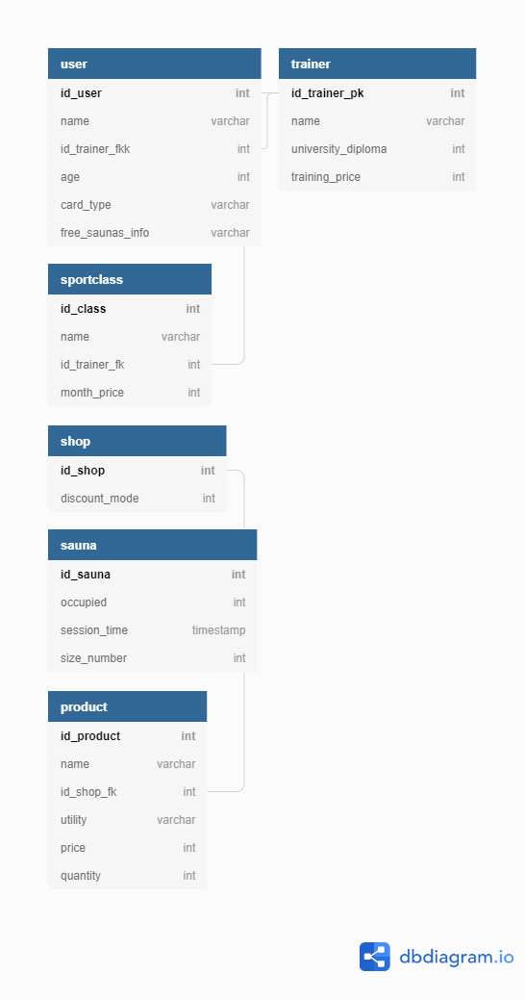
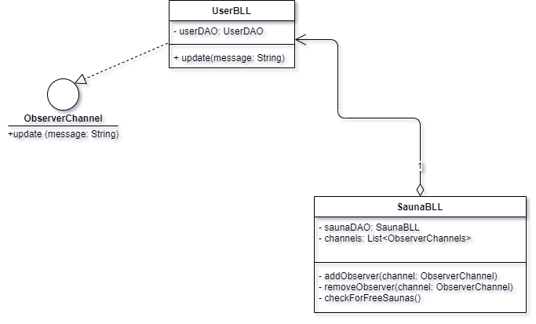

# FitnessProject

# Descrierea problemei
Aplicația Gym Management reprezintă o facilitate prin care orice pasionat de sport poate afla toate detaliile de care are nevoie despre sala de sport pe care acesta o frecventează. Aceasta oferă informații despre:

- Persoanele care au un abonament la sala de sport 
  - nume, antrenorul personal (dacă are unul), vârsta, tipul de abonament
- Antrenorii disponibili pentru a oferi antrenamente personalizate
  - nume, diplomă de absolvire a faculțății de sport / certificat de antrenor personal (dacă are una/unul), prețul pentru o lună de antrenamente personale
- Clasele de sport existente în cadrul sălii (Cycling, Kango-jump, etc)
  - nume, antrenorul personal care ține clasa de sport, prețul unui abonament la clasa de sport pentru o lună de antrenamente
- Management-ul saunelor pentru relaxarea de după antrenament
  - valabilitatea saunei (dacă se poate folosi acum sau nu), durata unei ședințe la saună, numărul maxim de persoane acceptate la saună
- Magazinele deținute de sala de sport
  - numărul magazinului împreună cu tipul de discount oferit al magazinului
- Produsele ce pot fi achiziționate din aceste magazine
  - nume, magazinul în care poate fi găsit, scopul produsului, prețul, cantitatea

Operațiile posibile în momentul de față asupra bazei de date a aplicației sunt:

- adăugarea unui/unei: user / antrenor / clase de sport / saune / magazin / produs (pentru un magazin anume)
- ștergerea unui/unei: user / antrenor / clase de sport / saune / magazin / produs (pentru un magazin anume)
- actualizarea unui/unei: user / antrenor / clase de sport / saune / magazin / produs (pentru un magazin anume)
- găsirea unui/unei: user / antrenor / clase de sport / saune / magazin / produs (pentru un magazin anume)
- găsirea tuturor: user-ilor / antrenorilor / claselor de sport / saunelor / magazinelor / produselor

# API-urile folosite
API (application programming interface) reprezintă un set de reguli și specificații pe care programele software le pot folosi pentru a comunica între ele.
În cadrul realizării acestui proiect, vor fi folosite următoarele API-uri:
- Spring
- Postman (folosit pentru testarea părții de back-end)
- Mockito
- Android 

# Implementare
Pentru ca acest proiect să fie realizabil, acesta va fi împărțit în două mari categorii:
### Back-end
Partea de back-end este cea care se va ocupa cu management-ul din "spatele aplicației". Așasar, tot ceea ce ține de baza de date va fi prelucrat folosind limbajul de programare Java prin intermediul IDE-ului IntelliJ.
Baza de date a fost creată în MySQL, aceasta conținând un număr de 6 tabele.
Fiecare tabel din baza de date este prelucrat prin intermediul a trei clase: model-ul tabelului, ce are ca variabile instanță câmpurile acestuia, un BLL (business logic layer) prin intermediul căruia se efectuează operațiile și accesul la baza de date și un DAO, care va fi descris mai jos.
Implementarea operațiilor și accesul la baza de date se află într-o clasă abstractă numită AbstractDAO, folosind tipuri generice care în urma apelurilor, vor fi înlocuite cu tipul de obiect care a apelat metodele respective, clasa fiind moștenită de toate celelalte clase DAO.
Testarea anumitor metode se face prin intermediul API-ului Mockito.
### Front-end
Partea de front-end reprezintă interfața grafică prietenoasă prin care utilizatorul va putea beneficia de aplicație. Aceasta va fi realizată în Android.

# Diagrame
### Diagrama bazei de date

### Diagrama design pattern-ului observer

